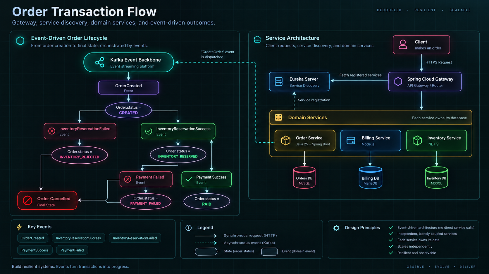
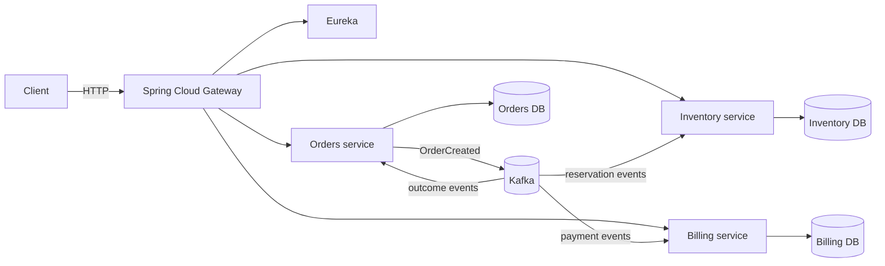

<div align="center">

# EventDrivenStore

### A production-shaped event-driven architecture for order transactions

EventDrivenStore is a distributed system built around independent bounded contexts, durable domain events, service-owned data, and failure-aware workflows. It follows an order from creation through reservation, payment, and a final business outcome.

<p>
  
  
  
  
</p>

<p>
  <a href="#the-system">The system</a> |
  <a href="#architecture-visual">Architecture visual</a> |
  <a href="#run-it-locally">Run it locally</a> |
  <a href="#knowledge-base">Knowledge base</a>
</p>

</div>

---

## The system

EventDrivenStore is a learning and engineering workspace for building distributed systems with the consequences left visible. An order is not treated as one synchronous function call. It becomes a sequence of facts that independent services can observe, persist, and react to.

The central question is:

> **How do we turn a multi-step transaction into resilient progress without giving every service direct access to every other service?**

The answer explored here is an event-driven order lifecycle:

```text
Create order
    |
    v
Reserve inventory ---- failure ----> Order cancelled
    |
    v
Authorize payment ---- failure ----> Order cancelled
    |
    v
Order paid
```

Each transition is represented by a domain event. Services own their own state, publish what happened, and consume only the events relevant to their responsibilities.

## Component map

| Component | Responsibility | Technology |
| --- | --- | --- |
| Orders Service | Creates orders, owns order state, and emits immutable order events | Java 25, Spring Boot, MySQL |
| Inventory Service | Owns stock state and reacts to order and reservation events | .NET, C#, MSSQL |
| Billing Service | Owns billing and payment workflows and reacts asynchronously | Node.js, Docker, MariaDB |
| Gateway | Provides the synchronous client boundary and routes to domain services | Spring Cloud Gateway |
| Service discovery | Keeps service locations dynamic instead of hardcoded | Eureka |
| Event backbone | Carries domain events between services | Apache Kafka |

The service repositories are maintained independently:

- [eds-orders](https://github.com/programmeralek/eds-orders)
- [eds-inventory](https://github.com/programmeralek/eds-inventory)
- [eds-billing](https://github.com/programmeralek/eds-billing)

## Architecture visual

The order transaction flow below shows both halves of the system: the event lifecycle on the left and the request, discovery, service, and database boundaries on the right.

<p align="center">
  
</p>

<p align="center"><em>Order creation becomes a sequence of events, state transitions, and service-owned outcomes.</em></p>

## Design principles

| Principle | How the project demonstrates it |
| --- | --- |
| Event-driven integration | Services publish domain events instead of calling one another directly |
| Saga choreography | Reservation and payment outcomes move the order forward or cancel it through events |
| Database per service | Each service owns its schema, transactions, and persistence boundary |
| Transactional outbox | State changes and outgoing event intent are coordinated for reliable publication |
| Idempotent consumers | Reprocessing events should not create duplicate business effects |
| Service autonomy | Services can evolve and scale independently behind explicit contracts |
| Failure-aware workflows | Retries, recovery, and partial failure are treated as normal operating conditions |

The design patterns are described using the STAR format in [STAR_specified_design_patterns.md](./KnowledgeBase/STAR_specified_design_patterns.md).

## Ownership and event flow



## Documentation paths

### Deployment strategy

The deployment documentation treats runtime boundaries as part of the architecture rather than an afterthought:

1. [Core deployment philosophy](./KnowledgeBase/Deployment/1.coreDeploymentPhilosophy.md)
2. [What actually gets deployed](./KnowledgeBase/Deployment/2.whatActuallyGetsDeployed.md)
3. [One Dockerfile per service](./KnowledgeBase/Deployment/3.oneDockerfilePerService.md)
4. [Environment configuration strategy](./KnowledgeBase/Deployment/4.environmentConfigurationStrategy.md)
5. [Service startup and dependency order](./KnowledgeBase/Deployment/5.serviceStartupAndDependencyOrder.md)
6. [Scaling strategy](./KnowledgeBase/Deployment/6.ScalingStrategy.md)
7. [Failure and recovery behavior](./KnowledgeBase/Deployment/7.failureAndRecoveryBehavior.md)
8. [Deployment and CI/CD readiness](./KnowledgeBase/Deployment/8.deploymentAndCiCdReadiness.md)

### Data and persistence

1. [Data ownership and boundaries](./KnowledgeBase/Data/1.data-ownership-and-boundaries.md)
2. [Orders service data model](./KnowledgeBase/Data/2.orders-data-model.md)
3. [Inventory service data model](./KnowledgeBase/Data/3.inventory-data-model.md)
4. [Billing service data model](./KnowledgeBase/Data/4.billing-data-model.md)
5. [Cross-service data boundaries](./KnowledgeBase/Data/5.cross-service-data-boundaries.md)
6. [Event payloads and persistence](./KnowledgeBase/Data/6.event-payloads-and-persistence.md)

### Local setup

1. [Prerequisites](./KnowledgeBase/LocalSetupGuide/1.prerequisites.md)
2. [Infrastructure bootstrapping](./KnowledgeBase/LocalSetupGuide/2.infrastructure-bootstrapping.md)
3. [Service startup order](./KnowledgeBase/LocalSetupGuide/3.service-startup-order.md)
4. [Local testing and verification](./KnowledgeBase/LocalSetupGuide/4.local-testing-and-verification.md)

## Run it locally

The repository's local setup guide is the source of truth for environment-specific commands. The short version is:

```bash
git clone git@github.com:L8TESTPR0JECTS/EventDrivenStore.git
cd EventDrivenStore
```

Then follow [Prerequisites](./KnowledgeBase/LocalSetupGuide/1.prerequisites.md), [Infrastructure bootstrapping](./KnowledgeBase/LocalSetupGuide/2.infrastructure-bootstrapping.md), and [Service startup order](./KnowledgeBase/LocalSetupGuide/3.service-startup-order.md).

## Repository map

```text
EventDrivenStore/
|- orders-service/       Order lifecycle and persistence
|- inventory-service/    Reservation and stock state
|- billing-service/      Payment and billing workflow
|- infrastructure/       Shared runtime and deployment building blocks
|- KnowledgeBase/
|  |- Data/               Ownership, schemas, and event persistence
|  |- Deployment/         Runtime, scaling, and recovery decisions
|  |- LocalSetupGuide/    Local startup and verification flow
|  `- order-transaction-flow.png
`- README.md              Product and architecture entry point
```

## Project status

EventDrivenStore is an evolving distributed-systems workspace. The architecture, service contracts, deployment notes, and data documentation are versioned together so that implementation decisions can be read alongside the reasoning behind them.

## License

No open-source license has been selected yet. Treat this repository as a private learning and engineering workspace unless a license is added.

